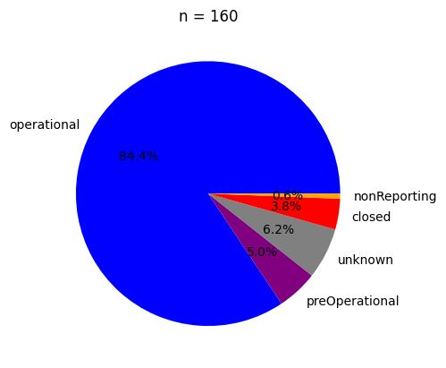
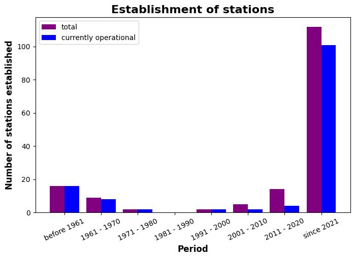
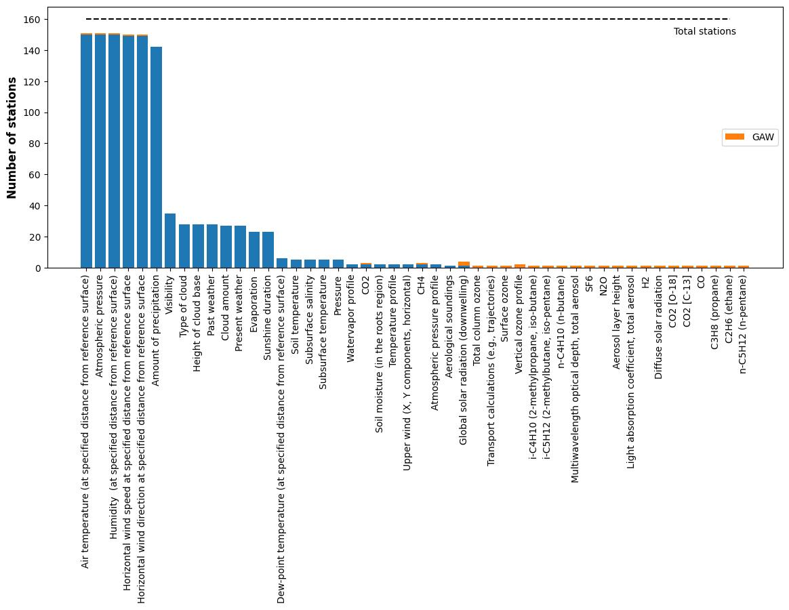
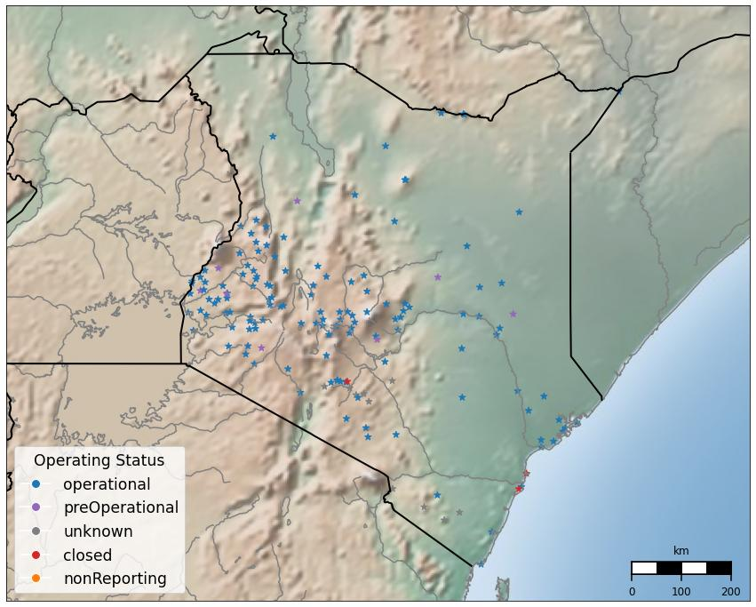
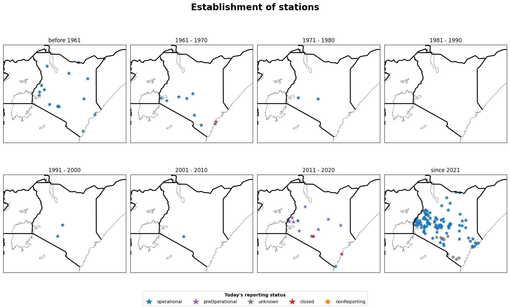
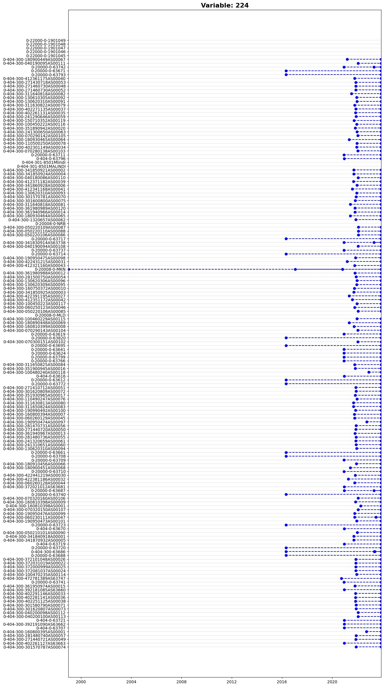
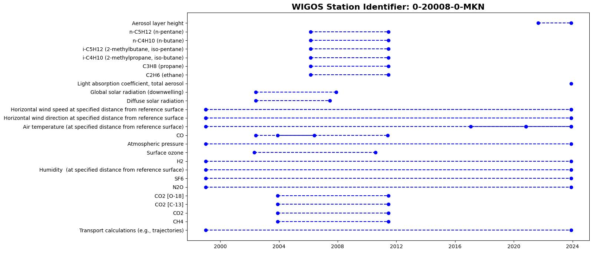
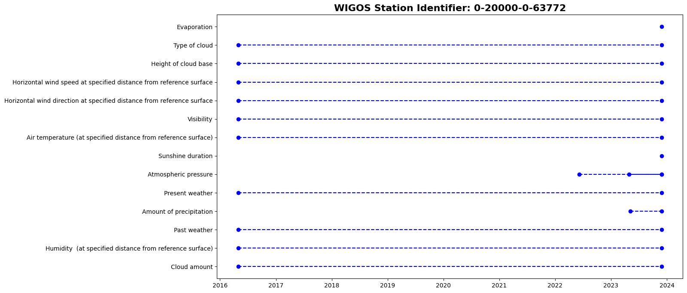
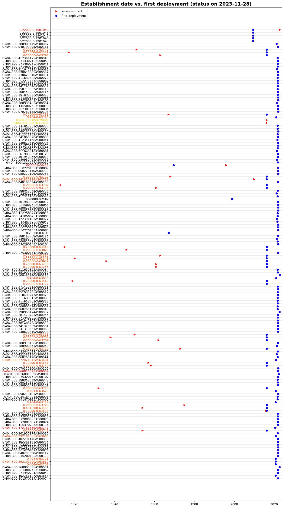

# About
Analysis of the [OSCAR/Surface](https://oscar.wmo.int/surface/#/) station catalogue using Kenya as an example. The general concept:
* get station identifiers through [OSCAR API](https://oscar.wmo.int/surface/rest/api/search/station?territoryName=KEN)
* analyse xml files from [jOAI](https://oscar.wmo.int/oai/) based on the WIGOS station identifiers 

## Python  
* used python version 3.10.6
* requirements: [Requirements file](./requirements.txt)
* plots are saved in folder [./Plots/](./Plots/) under the respective day of plotting them
* functions can be found in the following python files: [get_information.py](./get_information.py) (saving information from OSCAR API and xml files into data frame), [create_plots.py](./create_plots.py) (plotting functions), [create_animation.py](./create_animation.py) (create animation)
* this [execution file](./execution_file.ipynb) executes all the plotting functions to generate new plots
### Other files and folders
* [Sandbox](./OSCAR_analysis/sandbox): testing new stuff
* [WMDR dictionaries](./OSCAR_analysis/WMDR_dictionaries): variable dictionary to translate from WMDR notation to WMDR name (has to be updated when WMDR is updated)
* [Stations json](./stations.json): json filled with basic information on stations from OSCAR API (is overwritten when running this script)
* [Files](./OSCAR_analysis/Files): txt files from stations (used for finding information - are overwritten when running this script)

***-> More details in the [execution file](./execution_file.ipynb). Follow this script to generate new analyses.***

---

# Below some plots created on 11/28/2023 for Kenya are shown as an example

## Analysis over all stations registered within Kenya

### Pie chart with the number of stations for each reporting status
* so far, 160 stations are catalogued within Kenya
* most of them are operational

### Barplot over the decades showing how many stations were established & today's reporting status
* Most stations have been established since 2021. 
  

### Barplot of observed properties
* x axis: every variable measured at least once by a station in Kenya in the past
* y axis: number of stations measuring the respective variable at least once in the past
* orange: observations by GAW affiliated stations
  

---

## Map
### Spatial overview of all stations registered within Kenya

### Maps (one for every decade) with all catalogued stations established within that decade
* color of dots according to today's reporting status

## Animation: evolution over time
* The stations are added according to their year of establishment (blue dot). When they are closed, the dot turns red.
* Gif: [Evolution of stations over time](./Plots/2023-11-28/Animation_station_establishment_Kenya_2023-11-28_relief.gif)

---

## All deployments of a variable of interest in a country
* The y-axis shows all stations registered within a country, whereas the x-axis represents the time.
* All deployments of a variable of interest are indicated in blue. 
* E.g. Air temperature (at specified distance from reference surface) (WMDR notation: 224) in Kenya:

---

## Analysis of a specific station

### History of deployments at a station
* Example of the Mount Kenya station:

* The plot shows the registered deployments on OSCAR/Surface for the selected station. The y-axis shows the different variables measured, whereas the x-axis represents the time.
* The first point is the start of the deployment. The second point indicates the end point of the deployment. The blue dashed line in between indicates the duration of the deplyoment. -> e.g. MKN: Global solar radiation (downwelling)
* When there is no end date, the second point lies at today. -> e.g. MKN: Air temperature (at specified distance from reference surface)
* If there are more than two points and / or the line is solid, there are multiple deployments for a variable. -> e.g. MKN: CO
* In rare cases, there is no start date for a deployment (then only one point is visible). -> e.g. MKN: Light absorption coefficient, total aerosol
* Other plots in [this folder](./Plots) under the respective day of plotting (individual_stations)

## Analyses of ambiguities in the station catalogue

### History of deployments including establishment date
* Example of the Lamu station:

* The plot is the same as [Deployments at Mount Kenya](./Plots/2023-11-28/individual_stations/Deployments_0-20008-0-MKN_2023-11-28_.jpeg) with the establishment date added as a vertical red line.
* E.g. Lamu was established in 1908. The first deployment registered starts in 2016. There is a huge gap in between.

### Establishment date vs. date of first deployment

* The plot shows the establishment dates of the stations and the dates of the first registered deployments of the stations. The y-axis shows the stations, whereas the x-axis represents the time.
* The red triangles indicate the establishment date. The blue dots indicate the date of the first deployment. There is a black line in between when the establishment date does not correspond to the date of the beginning of the first deployment.
* If the establishment date is after the date of the first deployment, the station label appears in red.
* If the establishment date is before the date of the first deployment but does not correspond to it, the station label appears in orange.
* If the start date of the deployment is missing, the station label appears in yellow. 

